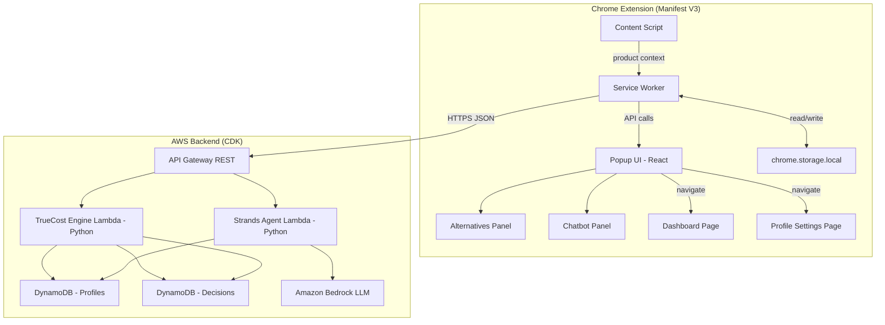
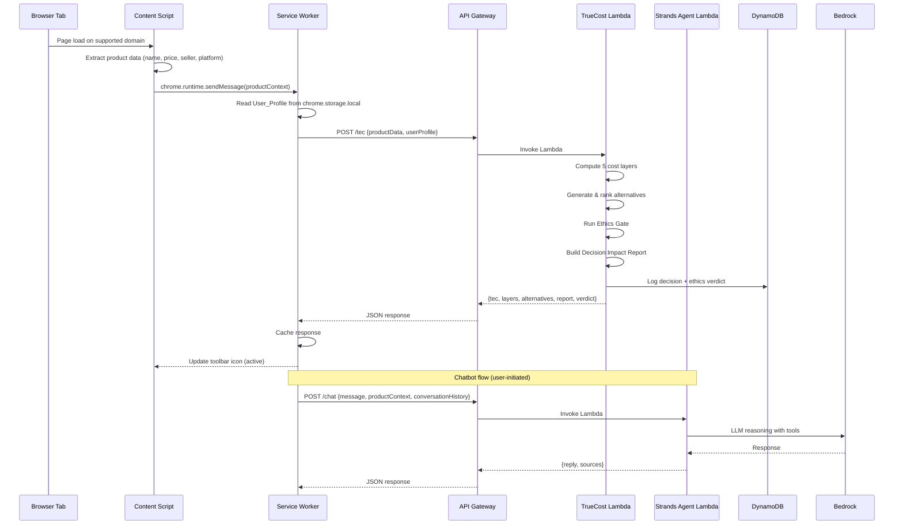
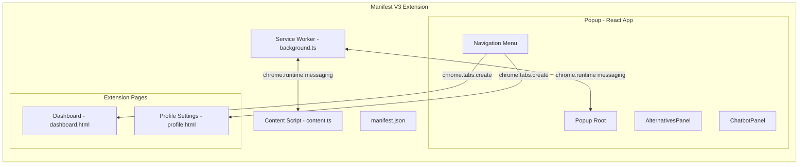

# Design Document: TrueCost Engine

## Overview

TrueCost Engine is a Chrome Extension (Manifest V3) with an AWS serverless backend that computes the True Expected Cost (TEC) of online purchases. The system intercepts product page visits, extracts pricing data, enriches it with five hidden cost layers personalized to the user's profile, and surfaces ranked alternatives — all within the browser. A conversational chatbot powered by Strands Agents SDK and Amazon Bedrock provides deeper analysis on demand. A dashboard tracks savings, decision history, and membership ROI over time. An ethics logic gate classifies pricing factors and halts analysis when unjustified pricing dominates.

The design follows a clear client-server split: the Chrome Extension owns all UI rendering, local profile storage, and page detection; the AWS backend owns all cost computation, alternative generation, chatbot reasoning, and persistent storage. Communication is JSON over HTTPS via API Gateway.

## Architecture

### System Architecture Diagram



### Component Communication Flow



### Extension Internal Architecture



## Components and Interfaces

### 1. Content Script (`content.ts`)

Injected into supported e-commerce, booking, and subscription domains. Responsible for detecting product pages and extracting structured product data from the DOM.

**Responsibilities:**
- Detect page type (product, booking, subscription) using URL patterns and DOM heuristics
- Extract product name, listed price, seller, and platform identifier
- Send extracted data to the Service Worker via `chrome.runtime.sendMessage`
- Clear product context on navigation away
- Display "unsupported page" message and manual entry fallback when extraction fails

**Interface:**
```typescript
interface ProductContext {
  productName: string;
  listedPrice: number;
  currency: string;
  seller: string;
  platformId: string;
  pageUrl: string;
  pageType: "product" | "booking" | "subscription";
  extractedAt: string; // ISO 8601
}

// Message sent to Service Worker
interface ProductDetectedMessage {
  type: "PRODUCT_DETECTED";
  payload: ProductContext;
}

interface ProductClearedMessage {
  type: "PRODUCT_CLEARED";
}
```

### 2. Service Worker (`background.ts`)

The Manifest V3 service worker acts as the central coordinator. It receives product context from content scripts, manages API communication, caches responses, and coordinates between UI components.

**Responsibilities:**
- Receive product context from content scripts
- Read User_Profile from `chrome.storage.local`
- Call backend APIs (TEC computation, chatbot, profile sync)
- Cache TEC responses per tab
- Update toolbar icon badge on product detection
- Relay data to popup and extension pages

**Interface:**
```typescript
// API client methods
interface BackendClient {
  computeTEC(product: ProductContext, profile: UserProfile): Promise<TECResponse>;
  chat(message: string, context: ChatContext): Promise<ChatResponse>;
  syncProfile(profile: UserProfile): Promise<SyncResult>;
  getDecisionHistory(userId: string, filters?: HistoryFilters): Promise<DecisionHistory>;
}
```

### 3. Popup UI (React)

Single popup view split into two panels: Alternatives Panel (top) and Chatbot Panel (bottom). Rendered when the user clicks the extension icon.

**AlternativesPanel Component:**
- Displays current product's listed price, TEC, and per-layer breakdown
- Lists 3–5 ranked alternatives with name, seller, price, TEC, badge, and link
- Shows loading state ("Calculating true cost...") while awaiting response
- Shows error state with retry button on failure

**ChatbotPanel Component:**
- Text input for user messages
- Scrollable conversation history
- Displays agent responses with markdown rendering
- Error state with retry for last message
- Session-scoped conversation history (cleared on page navigation)

### 4. Dashboard Page (`dashboard.html`)

Extension page showing cumulative savings, decision history, membership ROI, and ethics log.

**Sections:**
- Total Saved: running total of savings from chosen alternatives
- Decision History: filterable list (category, platform, savings type, time period)
- Membership ROI: per-membership savings vs. cost with net value
- Membership Alerts: renewal warnings within 30 days with renew/cancel recommendation
- Ethics Log: past Fairness Verdicts with product, date, and status

### 5. Profile Settings Page (`profile.html`)

Extension page for managing User_Profile attributes.

**Sections:**
- Memberships: add/edit/remove from predefined list (Amazon Prime, Walmart+, Target Circle 360, Sam's Club, Costco)
- Student Status: .edu email input with format validation
- Payment Methods: card name + cashback category percentages
- Return Comfort Level: slider 1–5
- Citizenship/Residency: country/region selector
- Cloud Sync: toggle to enable DynamoDB sync

### 6. TrueCost Engine Lambda (`truecost_handler.py`)

Python Lambda function that computes TEC, generates alternatives, runs the Ethics Gate, and builds the Decision Impact Report.

**Responsibilities:**
- Validate incoming JSON request against schema
- Compute each of the 5 cost layers using product data + user profile
- Aggregate layers into a single TEC value, weighted by Return Comfort Level
- Generate 3–5 alternatives (same-product-different-seller, different-timing, similar-product-better-value)
- Rank alternatives by ascending TEC
- Assign badges ("Best for you", "Lowest risk", "Easiest return")
- Run Ethics Gate on pricing factors
- Build Decision Impact Report
- Log decision and ethics verdict to DynamoDB
- Return HTTP 400 with validation errors for malformed requests

**Interface:**
```python
# Request
class TECRequest:
    product: ProductData
    user_profile: UserProfile

# Response
class TECResponse:
    tec: float
    currency: str
    layer_breakdown: dict[str, float]  # layer_name -> cost
    alternatives: list[Alternative]
    decision_impact_report: DecisionImpactReport
    fairness_verdict: FairnessVerdict
```

### 7. Strands Agent Lambda (`chatbot_handler.py`)

Python Lambda function using Strands Agents SDK with Amazon Bedrock for conversational chatbot reasoning.

**Responsibilities:**
- Initialize Strands Agent with Bedrock model provider (e.g., Claude Sonnet)
- Register custom tools for TEC data lookup, cost layer explanation, and timing analysis
- Process user messages with product context and conversation history
- Return contextually relevant responses referencing TEC data and user profile
- Handle errors gracefully with retry-friendly error responses

**Interface:**
```python
# Request
class ChatRequest:
    message: str
    product_context: ProductData
    tec_data: TECResponse  # current TEC computation
    conversation_history: list[ChatMessage]
    user_profile: UserProfile

# Response
class ChatResponse:
    reply: str
    sources: list[str]  # referenced data points
```

**Strands Agent Configuration:**
```python
from strands import Agent
from strands.models.bedrock import BedrockModel

model = BedrockModel(
    model_id="us.anthropic.claude-sonnet-4-20250514",
    region_name="us-east-1"
)

agent = Agent(
    model=model,
    system_prompt=TRUECOST_CHATBOT_SYSTEM_PROMPT,
    tools=[lookup_tec_data, explain_cost_layer, analyze_timing, compare_alternatives]
)
```

### 8. Ethics Gate Module (`ethics_gate.py`)

Pure Python module invoked by the TrueCost Engine Lambda. Classifies pricing factors and produces a Fairness Verdict.

**Classification Rules:**
- Justified: volume discounts, shipping distance, actuarial risk-based pricing, supply-and-demand
- Unjustified: location as income proxy, dark patterns, demographic pricing without actuarial basis

**Verdict Logic:**
- All justified → "clean"
- Some unjustified but not dominant → "flagged" + explanation
- Unjustified dominant → "halted" + reason (analysis stops)

**Interface:**
```python
class PricingFactor:
    name: str
    classification: Literal["justified", "unjustified"]
    weight: float  # contribution to price difference
    explanation: str

class FairnessVerdict:
    verdict: Literal["clean", "flagged", "halted"]
    factors: list[PricingFactor]
    explanation: str | None
    timestamp: str  # ISO 8601

def evaluate_ethics(
    original_price: float,
    alternative_prices: list[float],
    pricing_factors: list[PricingFactor]
) -> FairnessVerdict: ...
```

### 9. API Gateway Endpoints

| Method | Path | Lambda | Description |
|--------|------|--------|-------------|
| POST | `/tec` | TrueCost Engine | Compute TEC, alternatives, report |
| POST | `/chat` | Strands Agent | Send chatbot message |
| GET | `/profile/{userId}` | TrueCost Engine | Get user profile |
| PUT | `/profile/{userId}` | TrueCost Engine | Update user profile |
| GET | `/decisions/{userId}` | TrueCost Engine | Get decision history |
| POST | `/decisions/{userId}` | TrueCost Engine | Record a decision |


## Data Models

### UserProfile

```typescript
// TypeScript (Extension side)
interface UserProfile {
  userId: string;
  memberships: Membership[];
  studentStatus: StudentStatus | null;
  paymentMethods: PaymentMethod[];
  returnComfortLevel: 1 | 2 | 3 | 4 | 5;
  citizenshipResidency: CitizenshipResidency | null;
  cloudSyncEnabled: boolean;
  lastModified: string; // ISO 8601
}

interface Membership {
  provider: "amazon_prime" | "walmart_plus" | "target_circle_360" | "sams_club" | "costco";
  active: boolean;
  renewalDate: string | null; // ISO 8601
  annualCost: number;
}

interface StudentStatus {
  eduEmail: string;
  verified: boolean;
  verifiedAt: string; // ISO 8601
}

interface PaymentMethod {
  id: string;
  name: string;
  cashbackCategories: CashbackCategory[];
}

interface CashbackCategory {
  category: string; // e.g., "groceries", "online_shopping", "travel"
  percentage: number; // e.g., 3.0 for 3%
}

interface CitizenshipResidency {
  country: string; // ISO 3166-1 alpha-2
  region: string | null; // state/province
}
```

```python
# Python (Backend side) — Pydantic models
class UserProfile(BaseModel):
    user_id: str
    memberships: list[Membership]
    student_status: StudentStatus | None
    payment_methods: list[PaymentMethod]
    return_comfort_level: int = Field(ge=1, le=5)
    citizenship_residency: CitizenshipResidency | None
    cloud_sync_enabled: bool
    last_modified: str  # ISO 8601
```

### TECResponse

```python
class CostLayerBreakdown(BaseModel):
    risk_of_loss: float
    time_effort: float
    behavioral_pricing: float
    user_constraints: float
    path_effects: float

class Alternative(BaseModel):
    product_name: str
    seller: str
    platform_id: str
    listed_price: float
    tec: float
    currency: str
    badge: Literal["Best for you", "Lowest risk", "Easiest return"]
    product_url: str
    layer_breakdown: CostLayerBreakdown
    dominant_layer: str

class DecisionImpactReport(BaseModel):
    comparison_table: list[ComparisonRow]
    landscape_view: list[ScenarioVariation]  # >= 3 scenarios
    counterfactual_analysis: list[CounterfactualResult]
    profile_comparison: list[ProfileComparisonResult]  # >= 2 profiles
    fairness_verdict: FairnessVerdict

class ComparisonRow(BaseModel):
    product_name: str
    seller: str
    listed_price: float
    tec: float
    dominant_layer: str
    is_original: bool

class ScenarioVariation(BaseModel):
    scenario_name: str  # e.g., "Buy next week", "Use different platform"
    variable_changed: str  # "timing" | "platform" | "behavior"
    adjusted_tec: float
    delta_from_current: float

class CounterfactualResult(BaseModel):
    alternative_name: str
    savings_or_cost: float  # positive = savings, negative = additional cost

class ProfileComparisonResult(BaseModel):
    profile_label: str  # e.g., "Prime member with student discount"
    memberships: list[str]
    payment_methods: list[str]
    tec: float
    delta_from_user: float

class TECResponse(BaseModel):
    product_name: str
    listed_price: float
    tec: float
    currency: str
    layer_breakdown: CostLayerBreakdown
    alternatives: list[Alternative]  # 3-5 items, sorted by ascending TEC
    alternatives_complete: bool  # False if fewer than 3 available
    decision_impact_report: DecisionImpactReport
    fairness_verdict: FairnessVerdict
```

### DynamoDB Table Schemas

**Profiles Table (`truecost-profiles`)**

| Attribute | Type | Key |
|-----------|------|-----|
| userId | String | Partition Key |
| profile | Map | — |
| lastModified | String (ISO 8601) | — |

**Decisions Table (`truecost-decisions`)**

| Attribute | Type | Key |
|-----------|------|-----|
| userId | String | Partition Key |
| timestamp | String (ISO 8601) | Sort Key |
| productName | String | — |
| listedPrice | Number | — |
| chosenTec | Number | — |
| bestAlternativeTec | Number | — |
| savings | Number | — |
| category | String | — |
| platform | String | — |
| fairnessVerdict | String | — |
| ethicsFactors | List | — |

### ChatMessage

```python
class ChatMessage(BaseModel):
    role: Literal["user", "assistant"]
    content: str
    timestamp: str  # ISO 8601

class ChatRequest(BaseModel):
    message: str
    product_context: ProductData
    tec_data: TECResponse | None
    conversation_history: list[ChatMessage]
    user_profile: UserProfile

class ChatResponse(BaseModel):
    reply: str
    sources: list[str]
```

### FairnessVerdict (Ethics Gate)

```python
class PricingFactor(BaseModel):
    name: str
    classification: Literal["justified", "unjustified"]
    weight: float  # 0.0 to 1.0, contribution to price difference
    explanation: str

class FairnessVerdict(BaseModel):
    verdict: Literal["clean", "flagged", "halted"]
    factors: list[PricingFactor]
    explanation: str | None
    timestamp: str  # ISO 8601
    product_id: str
```


## Correctness Properties

*A property is a characteristic or behavior that should hold true across all valid executions of a system — essentially, a formal statement about what the system should do. Properties serve as the bridge between human-readable specifications and machine-verifiable correctness guarantees.*

### Property 1: TEC Aggregation Invariant

*For any* valid ProductData and UserProfile, the computed TEC SHALL equal the listed price plus the sum of all five cost layer values (risk_of_loss + time_effort + behavioral_pricing + user_constraints + path_effects), and the layer_breakdown SHALL contain exactly five non-negative entries.

**Validates: Requirements 2.1, 2.2**

### Property 2: Profile Discounts Reduce TEC (Metamorphic)

*For any* valid ProductData and two UserProfiles that differ only in the presence of a discount-providing attribute (active membership, verified student status, or cashback-eligible payment method), the TEC computed with the discount attribute present SHALL be less than or equal to the TEC computed without it.

**Validates: Requirements 2.3, 2.4, 2.5**

### Property 3: Return Comfort Level Affects Risk Weighting

*For any* valid ProductData and two UserProfiles that differ only in return_comfort_level (one at level 1, one at level 5), the risk_of_loss contribution in the layer_breakdown SHALL differ between the two computations, with the higher comfort level producing a lower or equal risk_of_loss cost.

**Validates: Requirements 2.6**

### Property 4: Alternatives Structural Invariants

*For any* valid TEC computation result, the alternatives list SHALL have between 0 and 5 entries, SHALL be sorted by ascending TEC value, each alternative SHALL have exactly one badge from {"Best for you", "Lowest risk", "Easiest return"}, and if the alternatives count is less than 3 then alternatives_complete SHALL be False.

**Validates: Requirements 3.1, 3.2, 3.3, 3.4**

### Property 5: Counterfactual Savings Derivation

*For any* TEC computation with alternatives, each entry in the counterfactual_analysis SHALL have a savings_or_cost value equal to the original product's TEC minus that alternative's TEC.

**Validates: Requirements 5.4**

### Property 6: Decision Impact Report Structure

*For any* valid TEC computation, the Decision_Impact_Report SHALL contain: a comparison_table with (1 + number of alternatives) rows each having listed_price, tec, and dominant_layer; a landscape_view with at least 3 ScenarioVariation entries; a profile_comparison with at least 2 ProfileComparisonResult entries; a counterfactual_analysis; and a fairness_verdict.

**Validates: Requirements 5.1, 5.2, 5.3, 5.5, 5.6**

### Property 7: Student Email Validation

*For any* string, the .edu email validator SHALL accept it if and only if it matches a valid email format ending with ".edu". Strings that do not end with ".edu" or do not conform to email format SHALL be rejected.

**Validates: Requirements 7.2**

### Property 8: Sync Conflict Resolution

*For any* two UserProfile versions with different lastModified timestamps, the sync conflict resolver SHALL always select the version with the later (more recent) timestamp.

**Validates: Requirements 7.6**

### Property 9: Dashboard Total Saved Aggregation

*For any* list of decision history records, the Total Saved value SHALL equal the sum of individual savings values (listed_price of purchased item minus TEC of chosen alternative) across all records.

**Validates: Requirements 8.1**

### Property 10: Decision History Filter Correctness

*For any* decision history list and any applied filter (category, platform, savings type, or time period), every record in the filtered result SHALL match the filter criteria, and no record matching the criteria SHALL be excluded.

**Validates: Requirements 8.3**

### Property 11: Membership ROI Computation

*For any* membership with recorded savings and a known annual cost, the net_value SHALL equal total_savings minus annual_cost.

**Validates: Requirements 8.4**

### Property 12: Membership Renewal Alert Timing

*For any* set of active memberships, an alert SHALL be generated for a membership if and only if its renewal date is within 30 days of the current date. Memberships with renewal dates more than 30 days away SHALL not generate alerts.

**Validates: Requirements 8.5**

### Property 13: Ethics Gate Factor Classification Completeness

*For any* set of pricing factors evaluated by the Ethics Gate, every factor SHALL be classified as exactly one of "justified" or "unjustified", and no factor SHALL remain unclassified.

**Validates: Requirements 9.1**

### Property 14: Ethics Gate Verdict Logic

*For any* set of classified pricing factors: if all factors are "justified" then the verdict SHALL be "clean"; if at least one factor is "unjustified" but the sum of unjustified factor weights does not exceed 0.5 then the verdict SHALL be "flagged" with a non-empty explanation; if the sum of unjustified factor weights exceeds 0.5 then the verdict SHALL be "halted".

**Validates: Requirements 9.4, 9.5, 9.6**

### Property 15: Malformed Request Validation

*For any* JSON payload that does not conform to the expected request schema, the TrueCost Engine Lambda SHALL return an HTTP 400 response with a JSON body containing a non-empty list of validation error descriptions.

**Validates: Requirements 10.6, 12.5**

### Property 16: TEC Response Serialization Round-Trip

*For any* valid TECResponse object, serializing it to JSON and then parsing that JSON back SHALL produce an object deeply equal to the original.

**Validates: Requirements 12.3**

### Property 17: UserProfile Serialization Round-Trip

*For any* valid UserProfile object, serializing it to JSON and then parsing that JSON back SHALL produce an object deeply equal to the original.

**Validates: Requirements 12.4**


## Error Handling

### Extension-Side Errors

| Error Scenario | Handling Strategy |
|----------------|-------------------|
| Content script cannot extract product data | Display "Page not supported" message with manual entry option (Req 1.3) |
| API request timeout (> 5s for TEC, > 8s for chat) | Show timeout error with retry button; use exponential backoff on retry |
| API returns HTTP 4xx | Display user-friendly error message; log raw response for debugging (Req 12.6) |
| API returns HTTP 5xx | Display "Service temporarily unavailable" with retry button |
| JSON response fails schema validation | Display generic error message; log raw response body to console (Req 12.6) |
| chrome.storage.local write failure | Retry once; if still failing, show warning that profile changes may not persist |
| Cloud sync conflict | Resolve using most-recent-timestamp strategy (Req 7.6) |
| Cloud sync network failure | Queue changes locally; retry on next sync interval; show sync status indicator |
| Chatbot conversation error | Display error inline in chat; allow retry of last message (Req 6.5) |

### Backend-Side Errors

| Error Scenario | Handling Strategy |
|----------------|-------------------|
| Malformed JSON request body | Return HTTP 400 with JSON body listing all validation errors (Req 10.6, 12.5) |
| Missing required fields in request | Return HTTP 400 with field-level validation errors |
| DynamoDB read/write failure | Return HTTP 500 with generic error; log full error to CloudWatch |
| Bedrock model invocation failure | Return HTTP 503 with "Chatbot temporarily unavailable"; implement retry with backoff |
| Ethics Gate produces "halted" verdict | Stop TEC analysis; return partial response with halt reason and verdict (Req 9.6) |
| Fewer than 3 alternatives found | Return available alternatives with `alternatives_complete: false` (Req 3.4) |
| Lambda cold start exceeds timeout | Configure provisioned concurrency for TEC Lambda; set API Gateway timeout to 10s |
| Invalid User_Profile in request | Return HTTP 400 with profile validation errors; do not process partial profiles |

### Error Response Format

```json
{
  "error": {
    "code": "VALIDATION_ERROR",
    "message": "Request validation failed",
    "details": [
      {"field": "product.listedPrice", "error": "Must be a positive number"},
      {"field": "userProfile.returnComfortLevel", "error": "Must be between 1 and 5"}
    ]
  }
}
```

Error codes: `VALIDATION_ERROR`, `INTERNAL_ERROR`, `SERVICE_UNAVAILABLE`, `ETHICS_HALTED`, `TIMEOUT`.

## Testing Strategy

### Unit Tests (Example-Based)

Unit tests cover specific scenarios, UI component rendering, edge cases, and integration points.

**Extension (TypeScript — Vitest + React Testing Library):**
- Content script extraction for specific supported domains (Amazon, Walmart, Target, etc.)
- Toolbar icon badge update on product detection (Req 1.2)
- Unsupported page fallback message (Req 1.3)
- Context clearing on navigation (Req 1.4)
- AlternativesPanel renders all fields for mock TEC data (Req 4.1, 4.2)
- Loading state shows "Calculating true cost..." (Req 4.3)
- Error state shows message + retry button (Req 4.4)
- Chatbot conversation history persistence (Req 6.2)
- Chatbot error state with retry (Req 6.5)
- Profile settings CRUD operations (Req 7.1, 7.3, 7.7)
- Dashboard ethics log rendering (Req 8.6)
- Manifest V3 permissions validation (Req 11.1)
- Popup renders both panels (Req 11.2)

**Backend (Python — pytest):**
- Ethics Gate classifies known justified factors correctly (Req 9.2)
- Ethics Gate classifies known unjustified factors correctly (Req 9.3)
- Lambda handler returns 400 for specific malformed payloads
- Strands Agent initialization with Bedrock model (Req 10.3)
- DynamoDB table key schema validation (Req 10.4)

### Property-Based Tests (Hypothesis for Python, fast-check for TypeScript)

Property-based tests verify universal properties across randomly generated inputs. Each test runs a minimum of 100 iterations.

**Python (Hypothesis):**
- **Feature: truecost-engine, Property 1**: TEC aggregation invariant — TEC = listed_price + sum of 5 layers
- **Feature: truecost-engine, Property 2**: Profile discounts reduce TEC (metamorphic)
- **Feature: truecost-engine, Property 3**: Return Comfort Level affects risk weighting
- **Feature: truecost-engine, Property 4**: Alternatives structural invariants (count, sort, badges, completeness flag)
- **Feature: truecost-engine, Property 5**: Counterfactual savings derivation
- **Feature: truecost-engine, Property 6**: Decision Impact Report structure completeness
- **Feature: truecost-engine, Property 13**: Ethics Gate factor classification completeness
- **Feature: truecost-engine, Property 14**: Ethics Gate verdict logic
- **Feature: truecost-engine, Property 15**: Malformed request validation returns 400
- **Feature: truecost-engine, Property 16**: TEC response serialization round-trip

**TypeScript (fast-check):**
- **Feature: truecost-engine, Property 7**: .edu email validation
- **Feature: truecost-engine, Property 8**: Sync conflict resolution (latest timestamp wins)
- **Feature: truecost-engine, Property 9**: Dashboard Total Saved aggregation
- **Feature: truecost-engine, Property 10**: Decision history filter correctness
- **Feature: truecost-engine, Property 11**: Membership ROI computation (net = savings - cost)
- **Feature: truecost-engine, Property 12**: Membership renewal alert timing (within 30 days)
- **Feature: truecost-engine, Property 17**: UserProfile serialization round-trip

### Integration Tests

- Chatbot responds to return risk questions referencing Risk_of_Loss_Layer (Req 6.3)
- Chatbot responds to timing questions referencing Behavioral_Pricing_Layer (Req 6.4)
- Ethics Gate logs verdicts to DynamoDB with all required fields (Req 9.7)
- End-to-end: product detection → TEC computation → alternatives display
- Cloud sync round-trip: local → DynamoDB → local

### Infrastructure Tests (CDK)

- CDK snapshot tests for all constructs (API Gateway, Lambda, DynamoDB, IAM)
- `cdk synth` produces valid CloudFormation template
- Verify API Gateway endpoint paths match specification (Req 10.1)
- Verify DynamoDB table key schemas (Req 10.4)
- Verify Lambda runtime is Python (Req 10.2)

### Test Configuration

| Framework | Language | Min Iterations | Config |
|-----------|----------|----------------|--------|
| Hypothesis | Python | 100 | `@settings(max_examples=100)` |
| fast-check | TypeScript | 100 | `fc.assert(property, { numRuns: 100 })` |
| pytest | Python | N/A | Standard unit tests |
| Vitest | TypeScript | N/A | Standard unit tests + React Testing Library |
